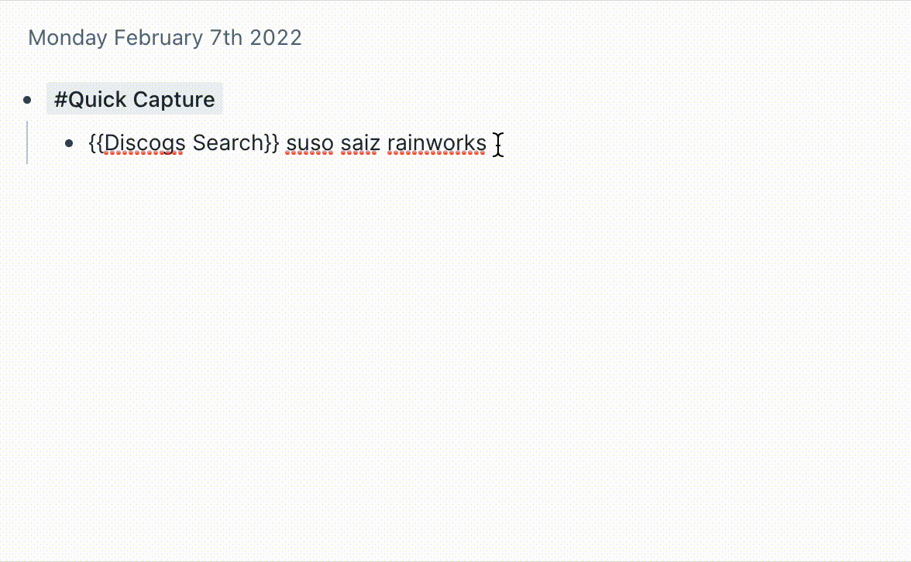

# Roam Research `{{Discogs Search}}`

## Installation

- Create a new block in your graph with the text `{{[[roam/js]]}}`.
- Click "Yes, I know what I'm doing".
- Create a new block as a child.
- Type a backslash (`/`), then find and select the "Javascript Code Block" option.
- Paste the contents of `index.js` into the child block.
- Get an API token from Discogs: https://www.discogs.com/settings/developers
- Replace your token in the code (line 22).

## Usage

- You can now create blocks with the text `{{Discogs Search}} <search terms here>`
- A button will appear. Click it and the release details will be written to your Roam graph.

## TODO

- better message to user when no results; only logs to console currently
